# 📐 Project Aura — System Diagrams

A comprehensive collection of UML and architecture diagrams for the Aura-3D gesture-controlled 3D sculpting system.

---

## 1. Use Case Diagram

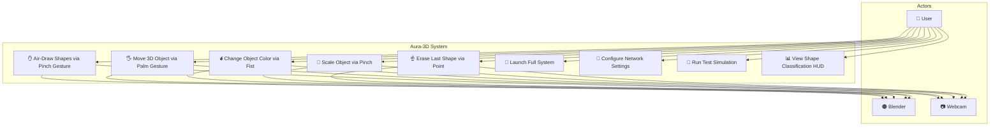

---

## 2. System Architecture Diagram

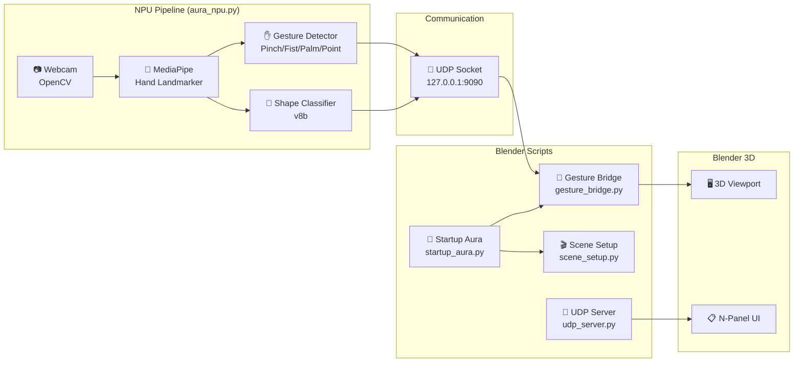

---

## 3. Class Diagram

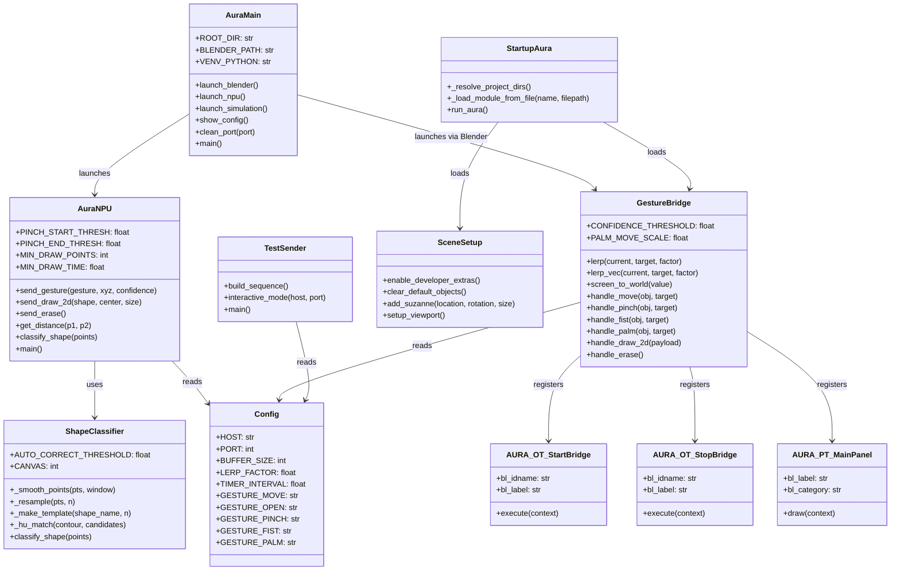

---

## 4. Sequence Diagram — Air-Drawing a Shape

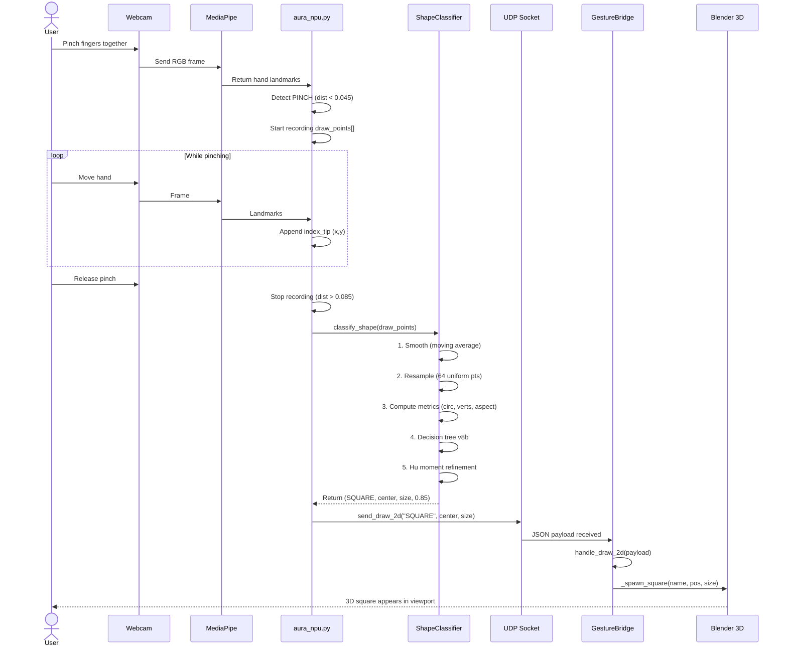

---

## 5. Sequence Diagram — Gesture Control Flow

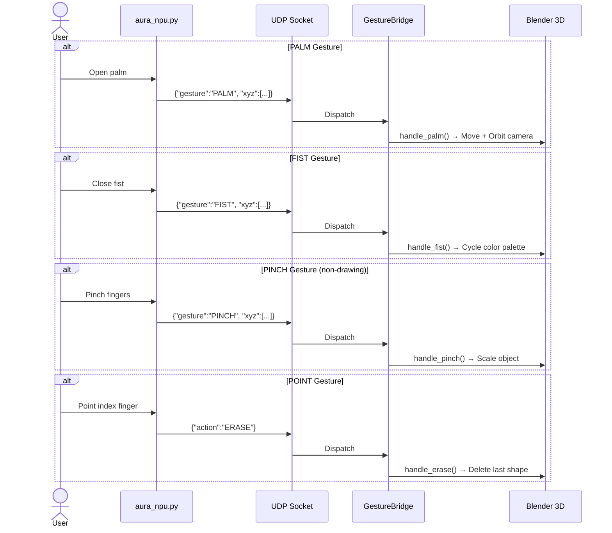

---

## 6. Activity Diagram — Shape Classification v8b

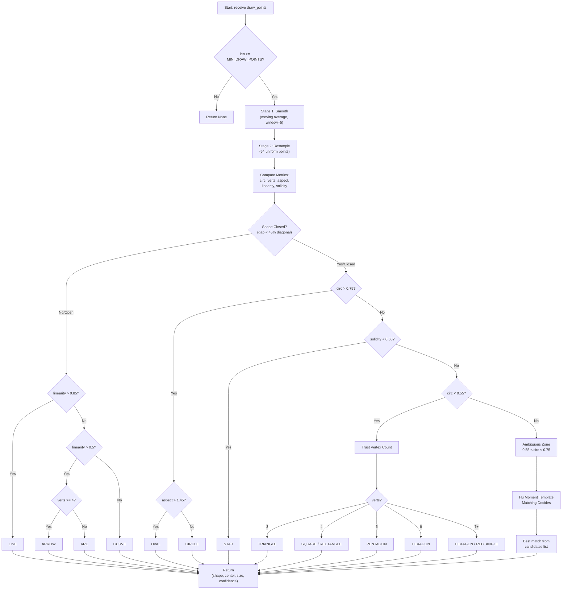

---

## 7. Component Diagram

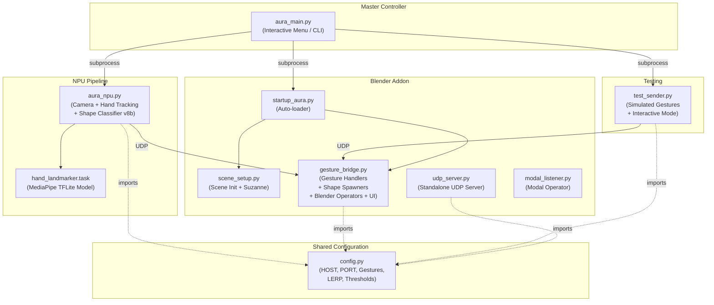

---

## 8. Data Flow Diagram

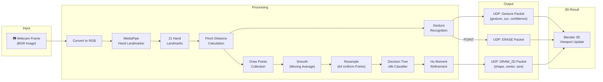

---

## 9. Deployment Diagram

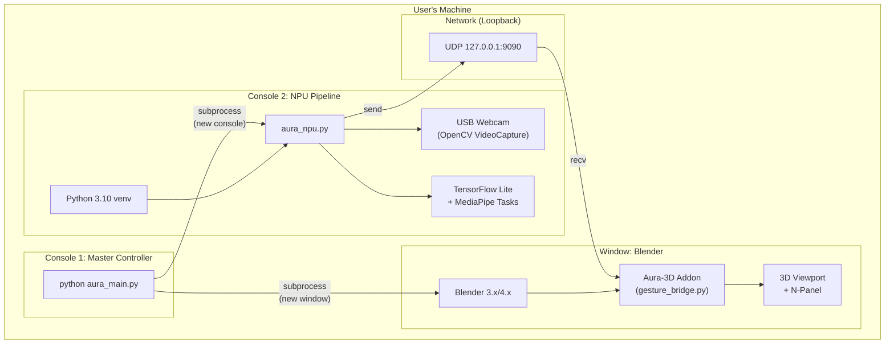

---

## 10. State Diagram — Drawing FSM

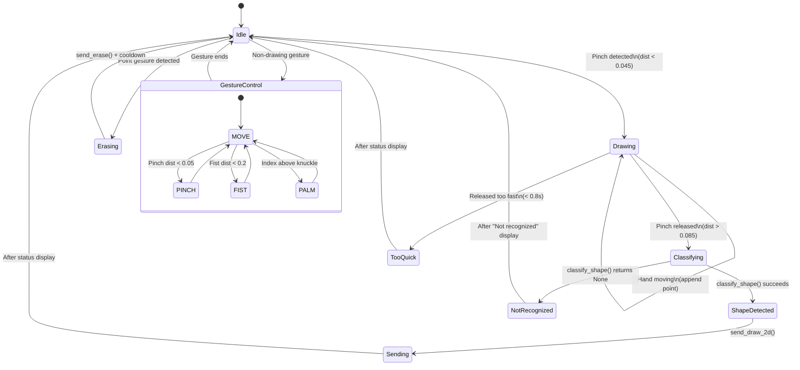

---

## 11. Shape Spawning Map

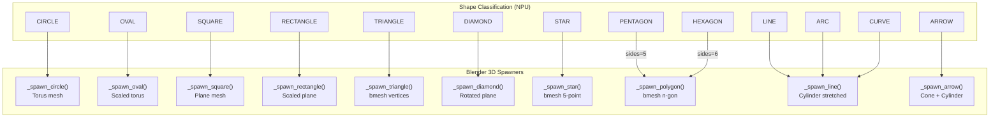
